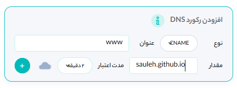
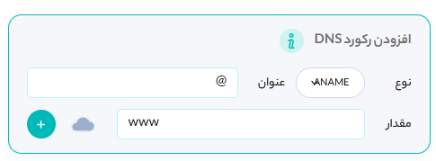
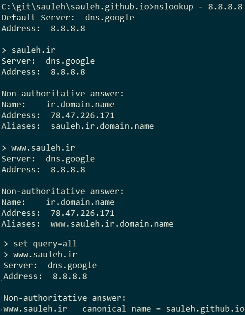

به نظر من ثبت و مدیریت دامنه برای دانشجویان رشته کامپیوتر تجربه مفیدی است. در این نوشته مراحلی را که برای ثبت و مدیرت [دامنه خودم](http://sauleh.ir) انجام دادم توضیح می‌دهم. 

# ثبت دامنه
- به سایت nic.ir مراجعه کرده و یک اکانت درست کنید.
- بخش ثبت دامنه را انتخاب کرده و یک دامنه موجود برای خودتون انتخاب کنید. برای شروع دامنه .ir به نظرم مناسب باشه. بعضی از زیر دامنه‌های دیگه مثل .ac.ir یا .co.ir دارای محدودیت هستند. 
- بعد از انتخاب دامنه اطلاعات تماس/آدرس‌تون رو وارد کنید. دقت کنید که این اطلاعات/آدرس برای عموم قابل رویت است. از این جهت شاید آدرس/تلفن محل کار/تحصیل برای وارد کردن مناسب‌تر باشه.
- هزینه ثبت‌نام برای ۱ سال ۱۶ هزار تومان است که از طریق کارت می‌توانید پرداخت کنید.
- بعد از پرداخت هزینه از شما یک nameserver می‌خواهد. چیزی که من استفاده کردم و فعلا مجانی هست سرویس دامنه ابر اروان است. اگر از ابر اروان می‌خواهید استفاده کنید، آدرس f.ns.arvancdn.com را وارد کنید.
- یه چند روز کاری طول می‌کشه تا ثبت دامنه‌تون تایید بشه. وقتی تایید بشه ایمیل براتون میاد.

# درست کردن وب‌سایت github-pages
- چنانچه اکانت گیت‌هاب ندارید، درست کنید.
- گیت‌هاب خودش به شما یک دامنه مثل sauleh.github.io اختصاص میده. قسمت اول دامنه نام کاربری شما خواهد بود.
- یک ریپازیتوری جدید برای وب‌سایت‌تون درست کنید. می‌توانید [این ریپازیتوری](https://github.com/sauleh/personal_website_template) را fork کنید و بعد بدلخواه تغییر بدهید.
- برای اطلاعات بیشتر در مورد روش استفاده از این قالب [این آدرس](https://mmistakes.github.io/minimal-mistakes/) را  ببینید.
- سپس در بخش settings ریپازیتوری نام آن را به username.github.io تغییر دهید و در بخش GitHub Pages تنظیم کنید که از روی ریشه شاخه مستر وب‌سایت شما را منتشر کند.
- بعد از این باید بتوانید وب‌سایت خود را در آدرس username.github.io مشاهده کنید.
- برای اطلاعات بیشتر در مورد روش استفاده از GitHub Pages به [این](https://pages.github.com/) مراجعه کنید.
- در انتهای این بخش فرض می‌کنیم وب‌سایت شما از آدرس username.github.io قابل دسترسی است.

# وصل کردن دامنه ثبت شده به آدرس گیت‌هاب
برای انجام این کار مراحل را طبق [این مستند](https://docs.github.com/en/github/working-with-github-pages/managing-a-custom-domain-for-your-github-pages-site#configuring-a-subdomain) دنبال می‌کنیم.
- چنانچه در مرحله اول آدرس سرویس دامنه ابر اروان را وارد کردید، یک اکانت [باز](https://naccounts.arvancloud.com/register?lang=fa) کنید. چنانچه سرویس دیگری مثل dnsfree انتخاب کردید، مراحل مشابه را در وب‌سایت مربوطه انجام دهید.
- پس از ورود به اکانت ابراروان بخش CDN را انتخاب کنید و سپس روی افزودن دامنه جدید کلیک کرده و دامنه‌ای که ثبت‌نام کردید را وارد کنید. مثلا sauleh.ir.
- پس از افزودن دامنه بخش «رکورد‌های dns» را انتخاب کنید.
- یک رکورد جدید از نوع CNAME با عنوان www و مقدار username.github.io اضافه کنید.
  
- این رکورد سرویس دامنه را به گونه‌ای تنظیم می‌کنه که مثلا www.sauleh.ir همان sauleh.github.io است.
- سپس یک رکورد جدید از نوع ANAME با عنوان @ و مقدار www.yourdomain.ir (مثلا www.sauleh.ir) ایجاد کنید. 
  
- این رکورد سرویس دامنه را به گونه‌ای تنظیم می‌کند که آدرس sauleh.ir همان آدرس www.sauleh.ir است. یعنی چه کسی www را به ابتدای دامنه اضافه کرد یا نکرد، به هر حال وب‌سایت شما را باز کند.
- بعد از چند دقیق چنانچه دستور‌های زیر را وارد کنید باید خروجی مشابه برای دامنه خود ببینید.
  

# تنظیم گیت‌هاب برای قبول دامنه جدید
برای تنظیم گیت‌هاب باید به بخش settings ریپازیتوری مربوط به وب‌سایت‌تون در گیت‌هاب مراجعه کنید و در بخش Custom Domain رفته و نام دامنه خود را بصورت www.yourdomain.ir (مثلا www.sauleh.ir) وارد کرده و دکمه save را انتخاب کنید. توضیحات بشتر را می‌توانید [اینجا](https://docs.github.com/en/github/working-with-github-pages/managing-a-custom-domain-for-your-github-pages-site#configuring-a-subdomain) پیدا کنید.