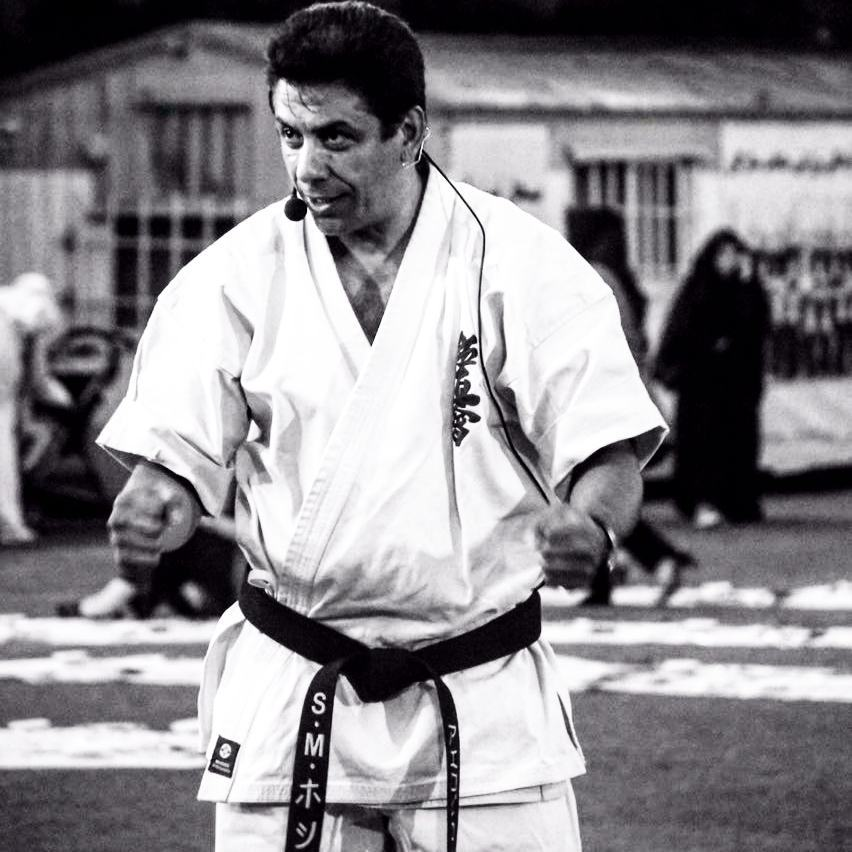
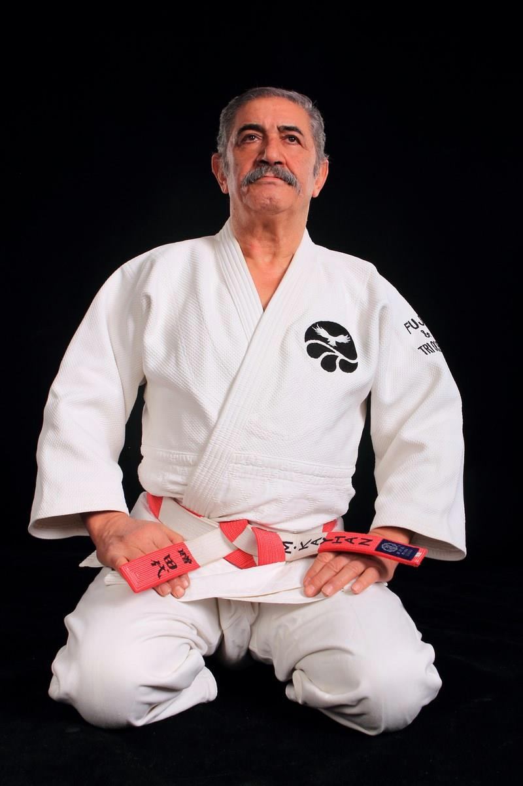

از سال ۹۶ که برگشتم تهران به فکر تاسیس یک مدرسه جوجیستو بودم ولی به خاطر مشغله زیاد، فرصت نشد. حالا که به لطف مدیریت تربیت‌بدنی دانشگاه این امکان فراهم اومده یه چند کلمه‌ای در مورد داستان هنرهای رزمی خودم می‌نویسم.

من از بچگی با دیدن فیلم‌های بروسلی به ورزش‌های رزمی علاقمند شدم. وقتی سال ۷۶ وارد دانشگاه شدم در گوشه تربیت‌بدنی دیدم چند نفر با لباس سفید مشت و لگد می‌زنند. تنها هنر رزمی که شنیده بودم کاراته بود. فکر می‌کردم آنها هم کاراته کار می‌کنند. بعد از چند هفته متوجه شدم تکواندو کار می‌کنند. یکسال با آنها تمرین کردم تا اینکه استادمون از دانشگاه رفت.

از تربیت‌بندی سراغ گرفتم گفتند <a href="https://www.instagram.com/kyokushinkhoshi/">استاد سید مرتضی خوشی</a>  سبک کیوکوشین کاراته را در دانشگاه شروع کرده. با استاد خوشی نزدیک ۴ سال تمرین کردم و کمربند مشکی دان یک خود را از فدراسیون کاراته دریافت کردم. فیلم زیر رو استاد خوشی برای معرفی سبک کیوکوشین تهیه کرده بود. توی یکی-دوتا صحنه از فیلم من هم هستم. یوتیوب به خاطر آهنگی که استاد استفاده کرده بود، صوتش رو حذف کرده.

<iframe width="1903" height="800" src="https://www.youtube.com/embed/hXFMtYS6zMo" title="Part1: Kyokushin Karate by Shihan Khoshi" frameborder="0" allow="accelerometer; autoplay; clipboard-write; encrypted-media; gyroscope; picture-in-picture" allowfullscreen></iframe>

<iframe width="1903" height="800" src="https://www.youtube.com/embed/z8XBvibSvWU" title="Part2: Kyokushin Karate by Shihan Khoshi" frameborder="0" allow="accelerometer; autoplay; clipboard-write; encrypted-media; gyroscope; picture-in-picture" allowfullscreen></iframe>

استاد خوشی هم از دانشگاه رفت و استاد اسماعیلی جای ایشون رو گرفت. کمتر از یکسال با ایشون تمرین می‌کردم تا از ایشون هم دان دو کاراته سبک و گواهی مربی‌گری درجه ۳ را دریافت کردم. 

مدتی بود استاد کیهان را که در دانشگاه جودو تدریس می‌کرد زیر نظر داشتم. حدود یکسال هم با <a href="https://www.instagram.com/kayhan_judo/">استاد کیهان</a>  جودو تمرین کردم.

با توجه به علاقه زیادی که به هنرهای رزمی داشتم. بعد از ورود به دانشگاه ایالتی میشیگان هم دنبال باشگاه رزمی اونها گشتم. یک باشگاه کوچک داشتند که سبک تانگ سودو کار می‌کردند. تعدادشون کم بود و مربی هم نداشتند. باشگاه جودوی دانشگاه فعال‌تر بود. حدود یکسال هم با اونها جودو تمرین کردم. استادمون Tom Sheehan بود. 
(نفر اول از سمت راست)

بعد از شروع کار در مایکروسافت در سال ۲۰۰۵ یک مدرسه کاراته سبک کیوکوشین در دانشگاه سیاتل پیدا کردم. استاد 
<a href="https://www.facebook.com/seattle.kyokushin">Keith Hill</a>
مربی اصلی مدرسه بود. به خاطر دور بودن مسیر هفته‌‌ای یکبار میرفتم. بعد از چند ماه از طرف مدرسه در مسابقات شمال شرق آمریکا شرکت کردم و در سنگین وزن مقام اول رو کسب کردم. برای مسابقات اصلا آمادگی و نفس نداشتم.

<a href="https://www.youtube.com/watch?v=LUxwe3Viw70">مسابقه اول</a> 
<a href="https://www.youtube.com/watch?v=otMJ5dBBh8M">مسابقه دوم</a> 
<a href="https://www.youtube.com/watch?v=uT9MPbJd0Lg">مسابقه سوم</a> 

اوایل سال ۲۰۰۶ یک روزی که در یوتیوب می‌گشتم با مسابقات
UFC
و خانواده 
Gracie
آشنا شدم. آقای 
Royce Gracie
که هیکل متوسطی داشت هم رقبا از سبک‌های مختلف از جمله سبک کیوکوشین رو شکست داده بود. این خانواده سبک برزیلی جوجیتسو رو تاسیس کرده بودند. بعد از یه مقدار جستجو دیدم در کل سیاتل دوتا مدرسه هست که یکیش نسبتا نزدیک به خونه‌مون بود. 
استادش آقای <a href="https://www.instagram.com/rodrigolopesgbseattle/">Rodrigo Lopes</a> بود.
<image src="assets/images/bjj_rodrigo.jpg" alt="Rodrigo Lopes" title="Rodrigo Lopes"/>

بعد چند هفته تمرین، همه فکر و ذکرم شده بود جوجیتسو. از هر فرصتی برای تمرین جوجیتسو استفاده می‌کردم. 